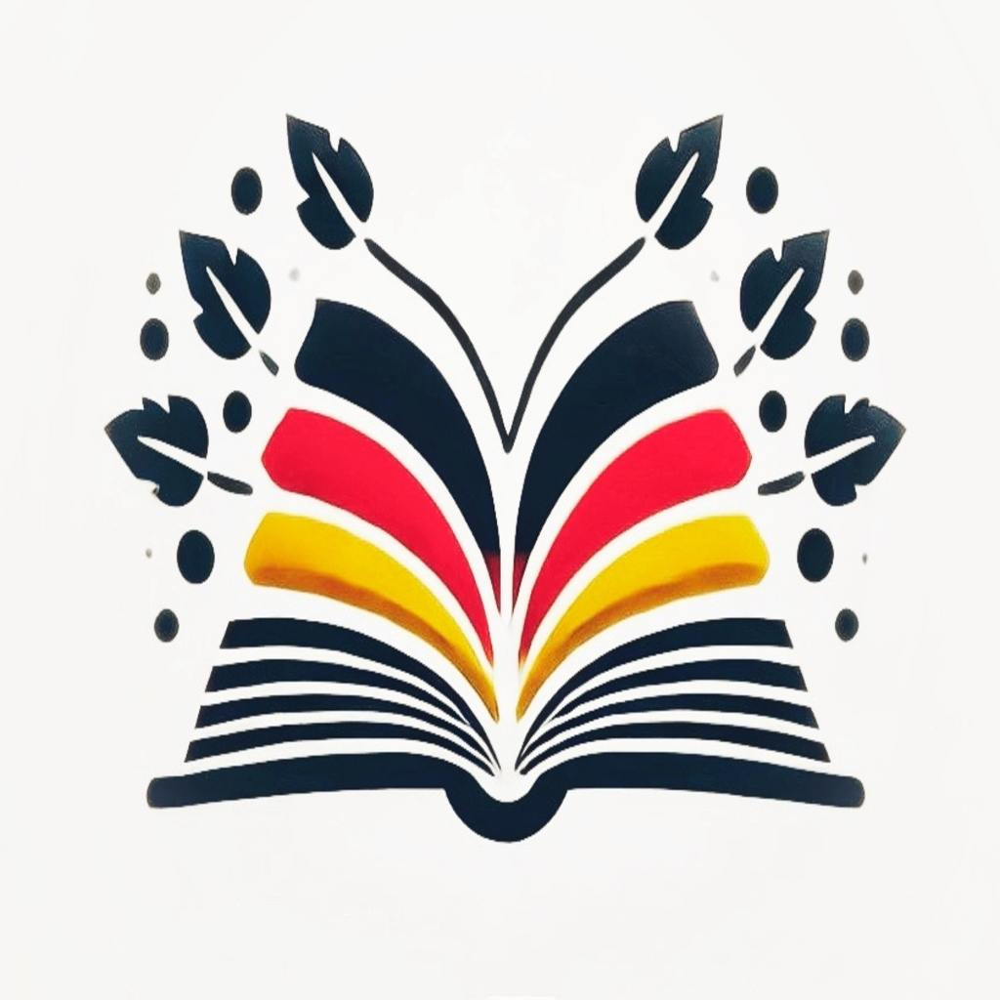

### Learning German —   изучайте немецкий язык легко и с удовольствием!

Ваш идеальный помощник для изучения немецкого языка уже здесь! Изучайте новые слова вместе с контекстом и проверяйте свои знания с помощью интерактивных викторин.

Ключевые особенности:

1. Динамичное обучение: осваивайте новые немецкие слова с контекстными примерами и переводами.

2. Интерактивные викторины: проверяйте свои знания в увлекательной форме с использованием интерактивных заданий.

3. Прогресс под контролем: следите за своими успехами с помощью статистики обучения.

4. Персональная библиотека: держите все выученные слова под рукой в удобном формате карточек.

5. Индивидуальные настройки: настраивайте дневные цели и адаптируйте приложение под свой стиль обучения.

Начните путь к свободному владению немецким языком уже сегодня!

## Контактная информация:
По любым вопросам относительно приложения пишите:
ekaterinaicenko@gmail.com

